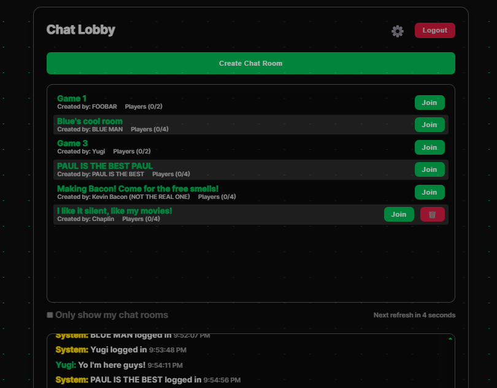

# SBA318 - Real-time Chat Lobby Application

A real-time chat lobby system built with Node.js, Express, and a
modular database system supporting both in-memory and MongoDB
storage (don't get excited, cause the MongoDB part doesn't work actually).

## Launching the app:

nodemon start
nodemon dev

## Launching the client:

localhost:3000

Note: You can launch multiple clients in different browser tabs and
talk to each other.  It works!

# History

The code for SBA318 was originally from my over-ambitious and abandoned
sba316 chat / game lobby code I was trying to get to work and I
couldn't.

But now SBA318 is what I wanted SBA316 to be, and even tho it's
got a few weird bugs and stability issues, when it works it
looks amazing!

# Requirements

| Requirement | Weight | Completed |
| :--- | :---: | :---: |
| Create and use at least two pieces of custom middleware. | 5% | ✅ |
| Create and use error-handling middleware. | 5% | ✅ |
| Use at least three different data categories (e.g., users, posts, or comments). | 5% | ✅ |
| Utilize reasonable data structuring practices. | 5% | ✅ |
| Create GET routes for all data that should be exposed to the client. | 5% | ✅ |
| Create POST routes for data, as appropriate. At least one data category should allow for client creation via a POST request. | 5% | ✅ |
| Create PATCH or PUT routes for data, as appropriate. At least one data category should allow for client manipulation via a PATCH or PUT request. | 5% | ✅ |
| Create DELETE routes for data, as appropriate. At least one data category should allow for client deletion via a DELETE request. | 5% | ✅ |
| Include query parameters for data filtering, where appropriate. At least one data category should allow for additional filtering through the use of query parameters. | 5% | ✅ |
| Utilize route parameters, where appropriate. | 5% | ✅ |
| Adhere to the guiding principles of REST. | 10% | ✅ |
| Create and render at least one view using a view template and template engine. This can be a custom template engine or a third-party engine. | 8% | ✅ |
| Use simple CSS to style the rendered views. | 2% | ✅ |
| Include a form within a rendered view that allows for interaction with your RESTful API. | 3%  | ✅ |
| Utilize reasonable code organization practices. | 5% | ✅ |
| Ensure that the program runs without errors (comment out things that do not work, and explain your blockers - you can still receive partial credit). | 10% | ✅ |
| Commit frequently to the git repository. | 5% | ✅ |
| Include a README file that contains a description of your application. | 2% | ✅ |
| Level of effort displayed in creativity, presentation, and user experience | 5% | ✅ |

## There are 3 paths in the main API to meet the requirements:

- The API is RESTFUL... the documentation can be found in api-reference.txt.  It's mostly
correct.  Real quick:

/users
-- This endpoint creates users (POST), updates users info (PATCH), queries users (GET)k
login (POST), logout (POST)

/lobby
-- This endpoint lets you create (POST) and fetch (GET) chatrooms/enter chatrooms/leave chatrooms

/chat
-- This endpoint fetches chat data for a user or for the lobby

The full details of all the routes are in api-reference.txt

## Accessing the EJS page

I ran out of time and didn't build a full "page" for the EJS part of the requirements.  I serve
it through a link on the login window, but it's not part of the UI flow.  The UI is amazing
but is mostly meaningless for a chat app.  Make sure to open a few other
windows and connect to the chat server before launching the EJS page.

## STUFF THAT IS BROKEN

- If the server is not running, index.html breaks badly.
- The mongoDB link on the front page goes to my cluster.  Don't use it lol.
- MongoDB support doesn't work
- If the server runs too long, the server or the client crashes, idk why
- All the code is super fragile. Small changes and everything falls apart.
- I started adding slash commands to the chat (/ignore /help etc), but like
  everything else I do, I was too ambitious and it doesn't work.
  The testplan.txt is generated by Gemini from screenshots and is lame.
  The api-reference.txt is also generated by Gemini and is out of date.
  There might be a few window.alerts that are still active
  Logout button doesn't always work
  The dashboard EJS loses data on the SEE refresh.  I didn't have time to fix it.
  So it's correct for like a second.

## Features

- User authentication (register/login)
- Real-time lobby
- Create and join chat rooms with player limits
- Nickname support for players
- Modular database system (in-memory or MongoDB - again, which doesn't work yet)
- Security features (sorta, it's middleware and if you run the server too long it disconects)

## Chat Room Features

- Create rooms with customizable player limits (1-4 players)
- Join/leave chat rooms
- Real-time player list updates
- Nickname display for all players
- You can password protect a room

## Database System

The application uses a modular database system that supports:
- In-memory storage (development)
- MongoDB (doesn't work yet!)
- Extensible for other database types

To add a new database engine:
1. Create new engine file in `database/`
2. Extend `BaseDbEngine`
3. Implement required methods
4. Add to `selectDbEngine.js`
5. Update DB_TYPE in `.env`

# The UI Style Sheets From Hell

SBA308a (my cat project) I did all the CSS myself and it took
almost about 5 days to get right and it was only like 80% of what
I wanted. My mentor says nobody does CSS style sheets by hand
anymore cause it's not a good use of time.

So for SBA318 I decided I was NOT going to style every single border
and color in this beautiful UI by hand.  I fed my index.html and my
dashboard.ejs into a CSS builder and described what I wanted and blam,
out came an amazing stylesheet.

Except it wasn't so simple.  It took almost 3 days to get the UI to
look as awesome as it was. Natural language CSS builders don't
work out of the box.  What it gets right looks amazing... what it
doesn't get right.. well... makes it impossible to debug. CSS builders
don't spit out comments and have so many weird bugs with scroll bars, 
etc., in the CSS I had to just go back to an older verison and try again.
